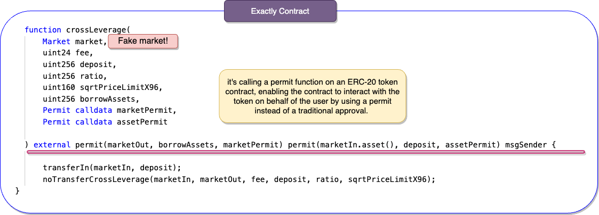
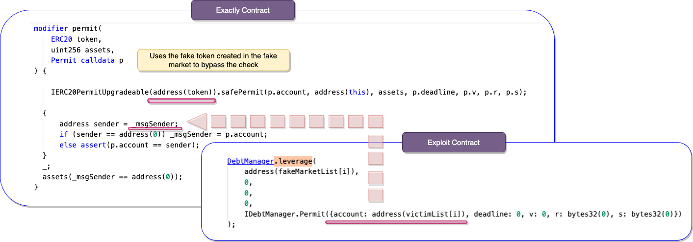
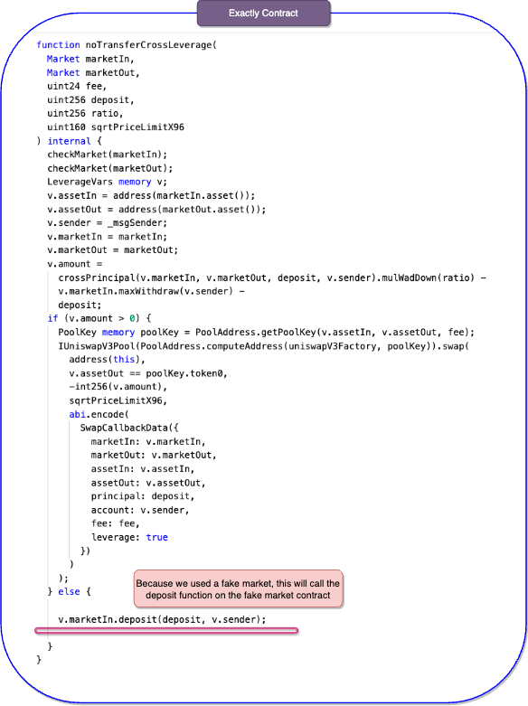

# Exactly

## What's Exactly?

Used to emphasize the accuracy of a figure or description.
"they met in 1989 and got married exactly two years later"

It's also a decentralized, self-custodial, open-source protocol to deposit and borrow crypto assets at variable and fixed interest rates.

## Amount stolen
**$7M USD**

24 august 2023

## Vulnerability

**Untrusted Input**

# Analysis

The exploiter creates a fake market, because of the lack of parameter checks it can be used instead of a legitimate market.

The exploiter repeats the first step 8 times, resulting in a list of fake markets. The markets are each set with a victim address with a lot of tokens,
the addresses of the victims are used within that `FakeMarket` contract to handle transactions.

Now the attackers calls the leverage function, using the victim and fake market to invoke the `noTransferLeverage` function.

In the permit function, the address is changed into the victim's address so the _msg sender check passes.

The `noTransferLeverage` function triggers the deposit function within the market contract. However, as we provided a fake market, it resulted in the execution of the deposit function located within the market contract we created.
  
In the market `deposit()` function, we trigger the `crossDelevage()`, which swaps tokens from the position to the fake token of the attacker.

 Finely we can call the `liquidate` function, to remove liquidity from the pool gaining profit.

[**< Back**](https://patronasxdxd.github.io/CTFS/)

