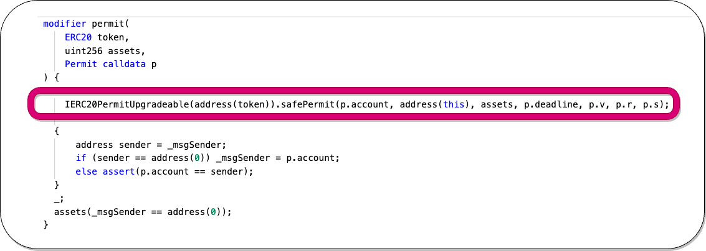

# [Title]


## What's [Title]?


## Amount stolen


## Vulnerability


## Analysis


### POC


1. Exploiter creates a new fake market and is able to use that due to lacking param checks

2. Exploiter repeats step 1 , 16 times, and finally has a list of fake markets.

3. First 8 markets are set as victim, with address of the real markets


5.  In the permit function, the address  is changed into the address of the victim so the msg sender is overwritten;

4. Now the 8 victims use the leverage function, this will invoke the noTransferLeverage to deposit, but since we gave a fake market place it will execute the deposit function that is on the fake market , we can alter that function.

5. In that fake market.deposit function, we trigger the crossDelevage(), which swapper tokens from the position to fake token of the attacker.


```solidity
  if (v.amount > 0) {
    // Exploitable code or missing checks?
    PoolKey memory poolKey = PoolAddress.getPoolKey(v.assetIn, v.assetOut, fee);
    IUniswapV3Pool(PoolAddress.computeAddress(uniswapV3Factory, poolKey)).swap(
      address(this),
      v.assetOut == poolKey.token0,
      -int256(v.amount),
      sqrtPriceLimitX96,
      abi.encode(
        SwapCallbackData({
          marketIn: v.marketIn,
          marketOut: v.marketOut,
          assetIn: v.assetIn,
          assetOut: v.assetOut,
          principal: deposit,
          account: v.sender,
          fee: fee,
          leverage: true
        })
      )
    );

❗  area of concern:
------------------------------------------------------------------------
    } else {
     v.marketIn.deposit(deposit, v.sender);
    }
  }
```




`IERC20PermitUpgradeable(address(token)).safePermit(p.account, address(this), assets, p.deadline, p.v, p.r, p.s);`


the line is calling a permit function on an ERC-20 token contract, 
enabling the contract to interact with the token on behalf of the user 
by using a permit instead of a traditional approval. This can be more gas-efficient 
in some scenarios, especially in DeFi protocols where multiple interactions with tokens are common.


# proof of concept (PoC) 

**Code provided by:** [DeFiHackLabs](https://github.com/SunWeb3Sec/DeFiHackLabs/blob/main/src/test/88mph_exp.sol)


[**< Back**](https://patronasxdxd.github.io/CTFS/)


