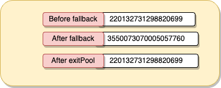
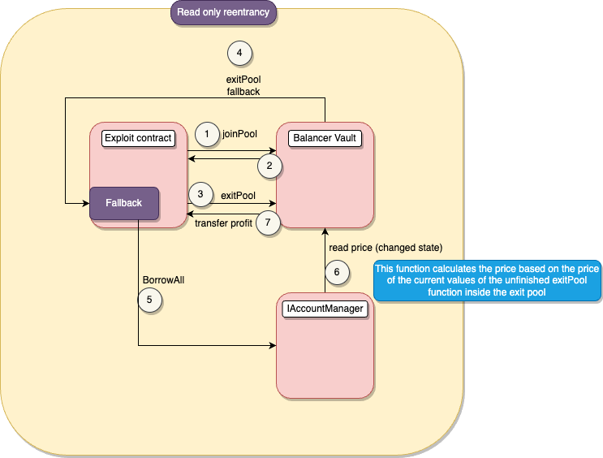

# Sentiment

## Amount stolen
**$1M USD**

March 3,2023

## Vulnerability
Read-Only-Reentrancy

## Analysis
The attacker used view re-entrance Balancer bug to execute malicious code before pool balances were updated and steal money using overpriced collateral

Reentrant attacks in read-only mode occur when a view function is initially called and later reentered by another function that alters the contract's state.
This vulnerability can be exploited by manipulating the values used in functions dependent on the returned results, leading to potential rate manipulation or incorrect parsing.

The vulnerability occurs when `_callPoolBalanceChange` returns the balance. Before the values are updated, the attacker exploits this window by borrowing additional tokens at the manipulated price caused by making an external from the fallback function to the contract that reads the collateral amount, at the temporal state which is manipulated. This allows them to take advantage of the temporarily distorted state of the pool, capitalizing on the price differential.


### Exploited code

```solidity
    function _joinOrExit(
        PoolBalanceChangeKind kind,
        bytes32 poolId,
        address sender,
        address payable recipient,
        PoolBalanceChange memory change
    ) private nonReentrant withRegisteredPool(poolId) authenticateFor(sender) {

        ** removed non exploit code **

        // The bulk of the work is done here: the corresponding Pool hook is called, its final balances are computed,
        // assets are transferred, and fees are paid.
        (
            bytes32[] memory finalBalances,
            uint256[] memory amountsInOrOut,
            uint256[] memory paidProtocolSwapFeeAmounts
        ) = _callPoolBalanceChange(kind, poolId, sender, recipient, change, balances);


        ** removed non exploit code **
    }
```

# Proof of concept (PoC) 

Attacker flashloaned 606 WBTC,10_000 ETH and 18 million USDC tokens the from sentiments lending pool

## Join pool

The attacker starts the attack by joining the pool and depositing the flash-loaned tokens.


## Exit pool
After successfully joining the pool, the attacker can execute the `exitPool` function to withdraw their liquidity. However, instead of completing a straightforward withdrawal, the attacker leverages the fallback function of the `exitPool` to borrow additional tokens.

## Borrow all

The `borrowAll` function is then triggered, calculating the price based on the current values of the incomplete `exitPool` function within the pool. 




The key advantage lies in the ability to borrow additional tokens at a lower price. This advantageous pricing is made possible by utilizing the collateral price, which, at this point, is significantly higher. By capitalizing on the dynamic changes in collateral prices, the attacker maximizes their gains, obtaining more tokens than would be possible under regular circumstances.

## Return Exit Pool

Finally, the attacker transfers the profits obtained from this manipulation back to their contract.




**Code provided by:** [DeFiHackLabs](https://github.com/SunWeb3Sec/DeFiHackLabs/blob/main/src/test/88mph_exp.sol)


[**< Back**](https://patronasxdxd.github.io/CTFS/)
