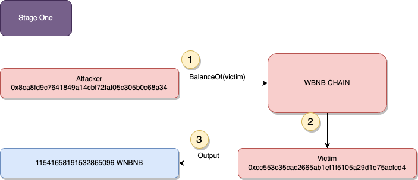
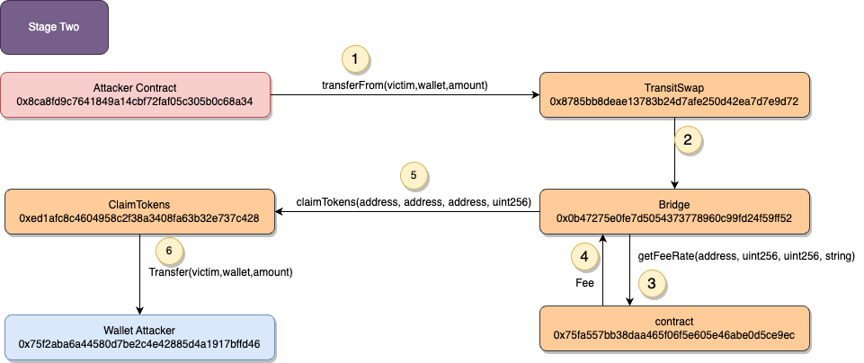

# Transit


## What's Transit?


## Amount stolen
**$21M USD**


## Vulnerability
Incorrect owner addres validation


## Analysis

The attacker exploits a contract vulnerability that allows dynamic calls to other contracts.

The contracts being called lack proper verification for the accessed contract, called function, and related parameters.

The claimTokens function in contract 0xed1a calls the transferFrom function in the WBNB contract.

As a result, the attacker transfers WBNB tokens from user accounts (e.g., 0xcfbc) to the attacker's address (0x75f2).

In Ethereum, when you use the call function, it allows you to send a message to another contract.
This message can include data that specifies which function of the target contract you want to call and with what arguments.

A User has approved all Wrapped BNB to contract Claimtokens

the attacker studied past transtactions to see he can use another persons 


### Exploited code

```solidity
   code here
```

# proof of concept (PoC) 








**Code provided by:** [DeFiHackLabs](https://github.com/SunWeb3Sec/DeFiHackLabs/blob/main/src/test/88mph_exp.sol)


[**< Back**](https://patronasxdxd.github.io/CTFS/)
