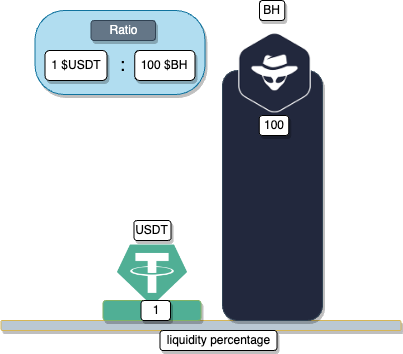
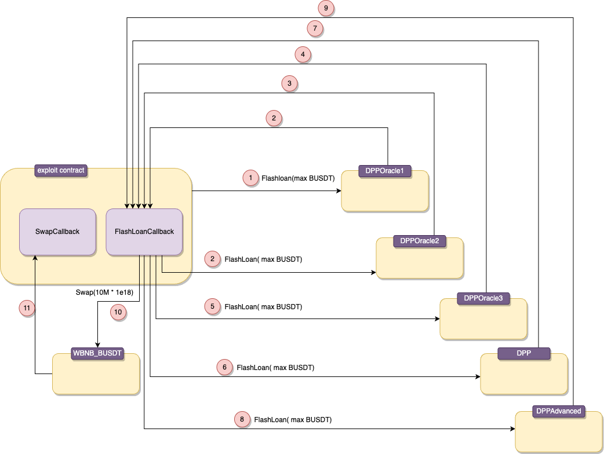
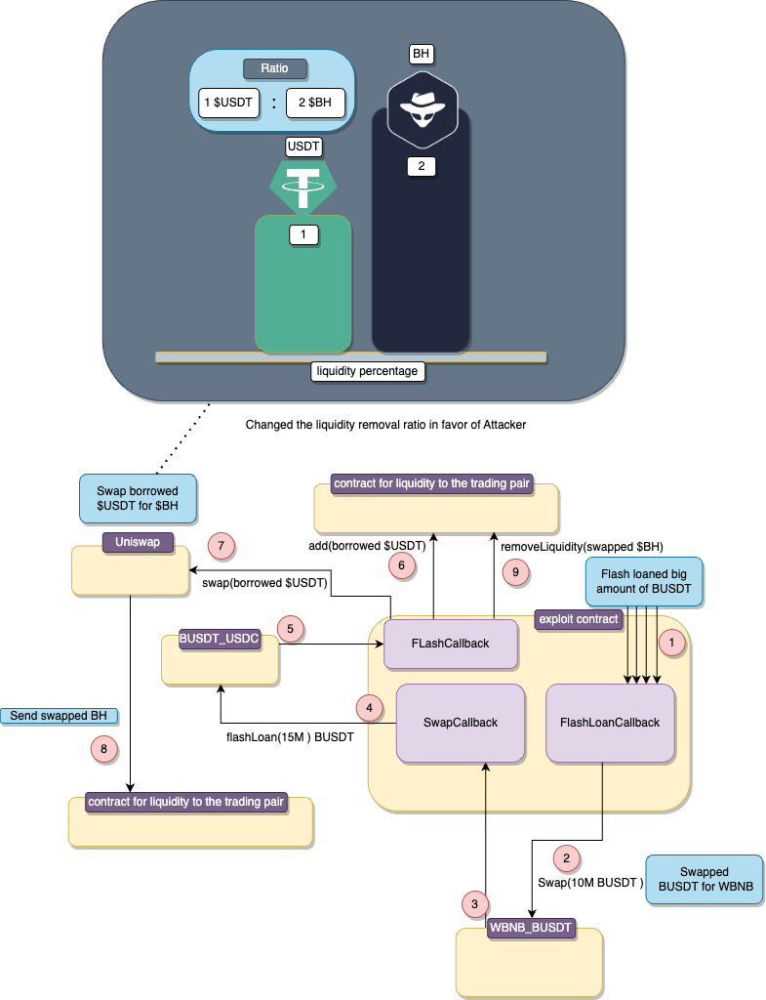

# BH

## What's BH?

## Amount stolen
**$1.27M USD**

October 11,2023

## Vulnerability

Price manipulation

## Analysis

The BH token suffered a price manipulation attack caused by flash loaning and swapping funds.

Before the exploitation, the liquidity removal ratio was 1 `USDT` to 100 `BH` tokens.

The attacker flash loaned a humongous amount of `USDT` tokens from multiple sources.

Following a successful flash loan: (the steps are referring to the graph down below)
- **step2** the attacker Swapped 10 million `USDT` for `WBNB` from `WBNB_BUSDT`;
- **step4** the attacker Flashloaned an additional 15 million `USDT` from `BUSDT_USDC`
- **step7** the attacker Swapped(15 million `USDT` for `BH` tokens causing the liquidity removal ratio to change in favor of the attacker.
- **step9** the attacker provoked the `0x4e290832` function which withdraws the `LP` tokens at an extremely discounted rate.

The loan was repaid, and the profit was moved.

**Code provided by:** [DeFiHackLabs](https://github.com/SunWeb3Sec/DeFiHackLabs/blob/main/src/test/BH_exp.sol)

[**< Back**](https://patronasxdxd.github.io/CTFS/)
