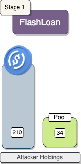
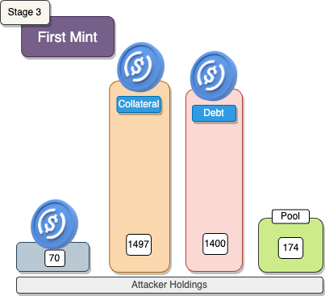
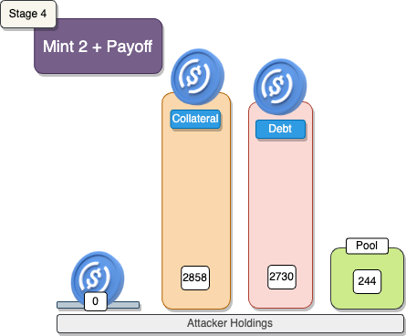
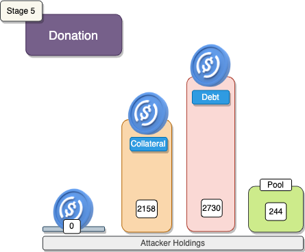
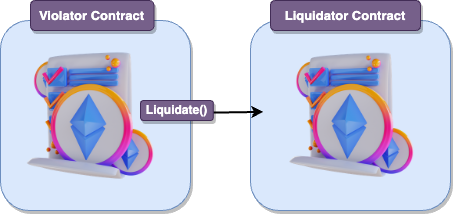
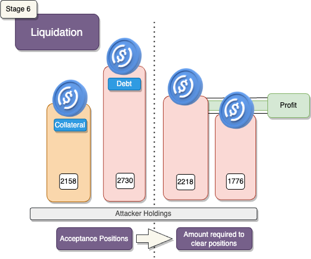

# Euler

## What's Euler?

Euler Finance is a lending /borrowing dapp on Ethereum. Users can lend tokens such as USDC, and cbETH - and any other tokens of the user’s choice -  in exchange for yield bearing LP tokens. These LP tokens could be converted back to the originally deposited funds with interest and governance tokens (EUL). 

Some LP tokens could also be used as collateral to borrow other assets on the Euler platform as well.

## Amount stolen
**$200M USD**

March 13, 2023

## Vulnerability

Because of added functionality to the protocol, a vulnerable method `donateToReserves` was introduced.
The problem was that `checkLiquidity` was missing, unlike the other interactions that require a positive health factor.


```solidity
    /// @notice Donate eTokens to the reserves
    /// @param subAccountId 0 for primary, 1-255 for a sub-account
    /// @param amount In internal book-keeping units (as returned from balanceOf).
    function donateToReserves(uint subAccountId, uint amount) external nonReentrant {
        (address underlying, AssetStorage storage assetStorage, address proxyAddr, address msgSender) = CALLER();
        address account = getSubAccount(msgSender, subAccountId);

        updateAverageLiquidity(account);
        emit RequestDonate(account, amount);

        AssetCache memory assetCache = loadAssetCache(underlying, assetStorage);

        uint origBalance = assetStorage.users[account].balance;
        uint newBalance;

        if (amount == type(uint).max) {
            amount = origBalance;
            newBalance = 0;
        } else {
            require(origBalance >= amount, "e/insufficient-balance");
            unchecked { newBalance = origBalance - amount; }
        }

        assetStorage.users[account].balance = encodeAmount(newBalance);
        assetStorage.reserveBalance = assetCache.reserveBalance = encodeSmallAmount(assetCache.reserveBalance + amount);

        emit Withdraw(assetCache.underlying, account, amount);
        emitViaProxy_Transfer(proxyAddr, account, address(0), amount);

        logAssetStatus(assetCache);
    }
```

```solidity
  function checkLiquidity(address account) internal {
        uint8 status = accountLookup[account].deferLiquidityStatus;

        if (status == DEFERLIQUIDITY__NONE) {
            callInternalModule(MODULEID__RISK_MANAGER, abi.encodeWithSelector(IRiskManager.requireLiquidity.selector, account));
        } else if (status == DEFERLIQUIDITY__CLEAN) {
            accountLookup[account].deferLiquidityStatus = DEFERLIQUIDITY__DIRTY;
        }
    }
```

## Analysis

### Health Scores

The Health Factor (HF) is calculated using the formula:

Health Factor (HF) = Amount Deposited / Amount Borrowed

- If HF is greater than or equal to 1, the health factor is considered **OK**.
- If HF is less than 1, the health factor is considered **not OK**.

Assume a user deposits 100 ETH into Euler, and after assessing the risk, these 100 ETH are valued at $50,000. The user decides to borrow DAI with a risk-adjusted value of $30,000, resulting in an initial health factor of 1.67, indicating a well-collateralized position.

As time progresses, the value of 100 ETH drops to $20,000, but the borrowed $30,000 DAI retains its value. Now, with the decreased value of the collateral, the health factor decreases to 0.67. This signifies that the user is undercollateralized since their $20,000 worth of ETH isn't enough to cover the borrowed $30,000 DAI. In this scenario, the user is underwater and may face challenges repaying the debt due to the reduced value of their collateral.

Euler mandates users to maintain a minimum health factor (HF) of 1. If their health factor falls below this threshold, the user becomes eligible for liquidation.


## Euler Protocol's Borrowing Mechanism: Recursive Borrowing (Mints)

The Euler Protocol introduces a unique feature called recursive borrowing, allowing users to increase their collateral without relying on external flash loan providers. This process is facilitated through the `mint()` function.

### Understanding Borrowing Limits

1. **Self-Collateral Factor (SCF):** This represents the amount of collateral needed for borrowing.
2. **Borrow Factor (BF):** A token-specific value determining the maximum percentage that can be borrowed.

### Practical Example: Borrowing USDC

Consider borrowing 1,000 USDC:
- The user needs to provide collateral worth over $1,634, considering the high Borrow Factor of USDC (e.g., 0.94).

### How the `mint()` Function Works

Using the `mint()` function, users can leverage their initial deposit. For instance:
- With a 1,000,000 deposit, they could potentially generate a maximum debt of 18,800,000, without factoring in conversion rates.

### Step-by-Step Borrowing Process:

1. **First Borrowing (1,000 USDC):**
   - Provide collateral worth $1,634.
   - Borrow 1,000 USDC.

2. **Subsequent Borrowing (1,000,000 USDC):**
   - After repaying the initial 1,000 USDC, the user can leverage their collateral.
   - Provide collateral worth 1,000,000.
   - Borrow a larger amount, potentially up to 18,800,000.

This recursive borrowing process enables users to incrementally borrow larger amounts against their collateral as they repay previous debts.


# proof of concept (PoC) 

## Stage 1: FlashLoan


| Variable      | Calculation                               |
|---------------|-------------------------------------------|
| `x`           | 10,000,000                                |
| `flashAmount` | x * 3                                   |
| `mintAmount`  | x * 2 * 10                              |
| `donateAmount`| x * 10                                  |
| `maxWithdraw` | (x * 3 * 9 * 2) / 10 - x                |


The attacker flashLoaned 30m USDC from AAVE.

`takeFlashLoan(provider, address(token), flashAmount * 10 ** token.decimals());` 



## Stage 2: Deposit


During this phase, we initiate the violator contract and transfer funds to it through the `transfer` function, using the parameters outlined in the previous table. Following this, we invoke the `violator` function of the contract to execute our `deposit`. This deposit accounts for two-thirds of the flash-loaned USDC amount, directing 20 million to the pool and receiving 19.5M eDAI from Euler.


## Stage 3: First Mint

Through the "recursive" `mint()` function, we will generate an amount ten times our initial deposit of USDC. This results in the creation of 195.6M eDAI and 200M dDAI, all minted from Euler.




## Stage 4: Payoff + Second Mint


We will utilize the remaining one-third of the funds to repay a portion of the debt through the `repay()` function, an equivalent of 10M DAI. Euler will burn 10M dDAI as a result.




## Stage 5: Donation

Donating ten times the amount of our repaid funds to `donateToReserves()`, equivalent to 100M eDAI to Euler. Results in our health factor falling below 1. Meaning our **collateral** is lower than our **debt**.



## Stage 6: Liquidation + Payoff

At the end of the validator contract, it triggers another contract called the liquidator. The liquidate function within the liquidator contract initiates the process of liquidating the bad loan that was introduced by the violator contract.



The liquidator contract initiates the liquidation process, taking advantage of the discounted rate resulting from the low health factor, yielding a profit in USDC.



## Stage 7: Withdrawal + FlashLoan Payoff

The attacker successfully executed the withdrawal of the entire token amount from Euler using the withdraw() function, obtaining a sum of 38.9 million DAI. After the repayment of the flash loan, the attacker yielded a net gain of 8,877,507 DAI.

`Attacker DAI balance after exploit: 8877507.34830669726742829`


**Code provided by:** [DeFiHackLabs](https://github.com/SunWeb3Sec/DeFiHackLabs/blob/main/src/test/Euler_exp.sol)


[**< Back**](https://patronasxdxd.github.io/CTFS/)
