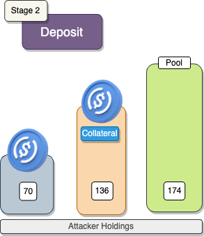

Euler

## What's Euler?

Euler Finance is a lending /borrowing dapp on Ethereum. Users can lend tokens such as USDC, and cbETH - and any other tokens of the user’s choice -  in exchange for yield bearing LP tokens. These LP tokens could be converted back to the originally deposited funds with interest and governance tokens (EUL). 

Some LP tokens could also be used as collateral to borrow other assets on the Euler platform as well.

## Amount stolen
$200M USD


## Vulnerability
**$200M USD**

March 13, 2023

## Analysis

https://www.coinbase.com/blog/euler-compromise-investigation-part-1-the-exploit

### Health Scores

The Health Factor (HF) is calculated using the formula:

Health Factor (HF) = Amount Deposited / Amount Borrowed

- If HF is greater than or equal to 1, the health factor is considered **OK**.
- If HF is less than 1, the health factor is considered **not OK**.


Let's say a user supplies 1 WETH to Euler and that risk adjusted WETH is currently valued at $880 and then borrows a risk adjusted value of $500 worth of DAI. This would equal a health factor 1.76. Over the following days, that risk adjusted value of 1ETH  drops to $400. But the $500 DAI is still worth $500. This now leads to a health factor of 0.8 - meaning that the borrower is undercollateralized (i.e. can't pay back the amount they borrowed because they only have $400 worth of WETH) and is underwater. 

uler requires that users have a minimum 1 health factor (HF). If they fall below a HF of 1, they get liquidated. 


### Self-collateralized loans (Mints)

Another unique feature of the Euler Protocol is a recursive borrowing functionality which allows one to leverage up their collateral using an eToken mint function. The feature allows for greater gas efficiency by using Euler’s built-in lending protocol without the need for external flash loan providers.

The maximum mint amount is bound by SCF (Self-Collateral Factor) 0.95 and a token specific BF (Borrow Factor) using a formula below:

### Exploited code

```solidity
   code here
```

# proof of concept (PoC) 


## Stage 1: FlashLoan

| Variable      | Calculation                               |
|---------------|-------------------------------------------|
| `x`           | 10,000,000                                |
| `flashAmount` | x * 3                                   |
| `mintAmount`  | x * 2 * 10                              |
| `donateAmount`| x * 10                                  |
| `maxWithdraw` | (x * 3 * 9 * 2) / 10 - x                |


`takeFlashLoan(provider, address(token), flashAmount * 10 ** token.decimals());`


  [*] Attacking DAI...
  
  [*] Euler balance before exploit: 8904507 DAI
  
  [*] Borrowing 30000000 DAI


## Stage 2: Deposit

In this stage we create the violator contract and transfer money to Violator contract by using the `transfer` function with the parameters given before.
Afterwards we can call the `violator` function of the contract to make our first `deposit` of 2/3 of our flashloaned amount and send 20 million to the pool to receive 19.5M eDAI from Euler



## Stage 3: First Mint

We will mind 10 times the amount of our deposited amount using `mint()`, an equivalent of 195.6M eDAI and 200M dDAI from euler


## Stage 4: Payoff + Second Mint

We will repay part of the debt using the remaining 1/3 of funds using `repay()', an equivalent of 10M DAI, Euler will burn 10M dDai


## Stage 5: Donation

When we donate the 10 tunes the amnount of our repaid funds to `donateToReserves()`, an equivalant of 100M eDAI to euler it will leave our health facor below 1.


## Stage 6: Liquidation + Payoff


## Stage 7: Withdrawal + FlashLoan Payoff


**Code provided by:** [DeFiHackLabs](https://github.com/SunWeb3Sec/DeFiHackLabs/blob/main/src/test/88mph_exp.sol)


[**< Back**](https://patronasxdxd.github.io/CTFS/)
