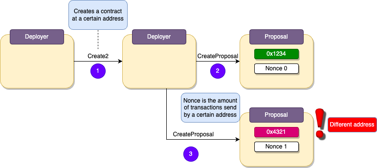
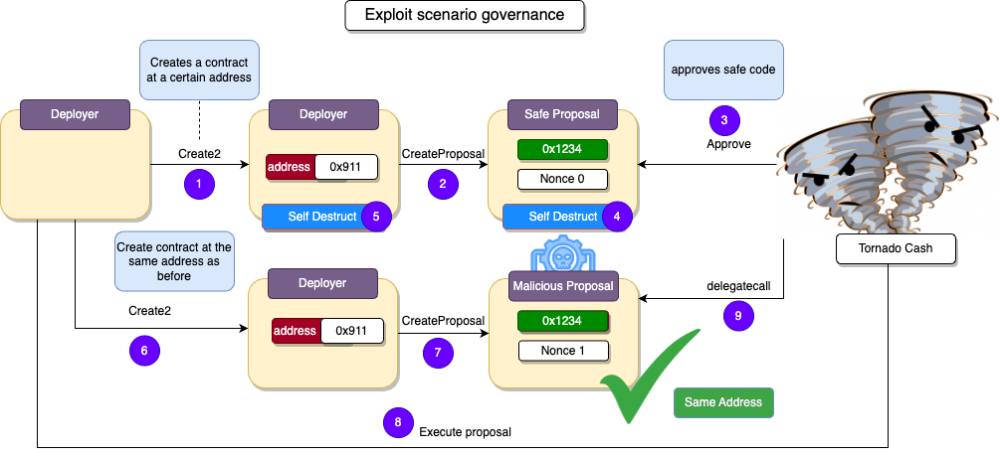
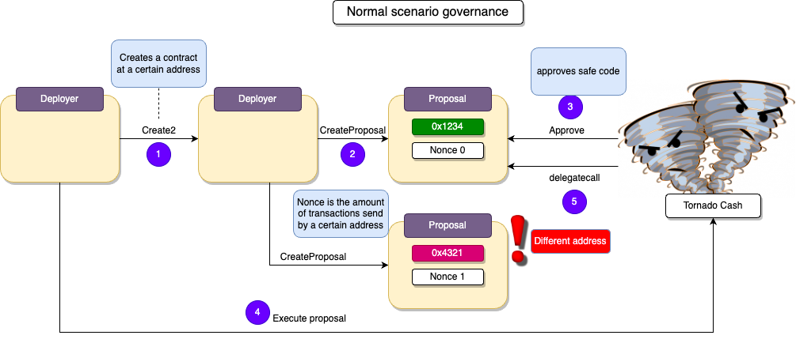

# TornadoCash

## Vulnerability

## Analysis

With governance the user is allowed to send proposal that execute code in the tornade prototcal, there is a safety check to see if the code contains malicious code
and it prevents the user from executing it.

The problem is that once a user deploys malicious code on the same address as the previously accepted proposal. It can be executed, where the user is able
to gain control of the ownership or withdrawal of all the funds in the pool.

To demonstrate this we can differentiate a normal situation from an exploited one.

## How can we deploy a proposal at the same address?

A address is made by this formula ` address = last 20 bytes of sha3(rlp(sender,nonce))` 

We are able to assert the same sender, due to the `create2` function, where we can deploy a proposal factory.

the nonce is the number of transactions the address has sent, so it starts at nonce 0 and if we create a second proposal it will have nonce 1
and a new address.

## How can we reset the nonce?

To reset nonce you will have to redeploy the address of the contract.
the exploit is done by destorying the initial proposal of the proposal factory
and redeploying it on the same address by using the `create2` function, where its able to reset the nonce and successfully swap the safe code
with malicious code.

**Code provided by:** [DeFiHackLabs](https://github.com/SunWeb3Sec/DeFiHackLabs/blob/main/src/test/88mph_exp.sol)

[**< Back**](https://patronasxdxd.github.io/CTFS/)
