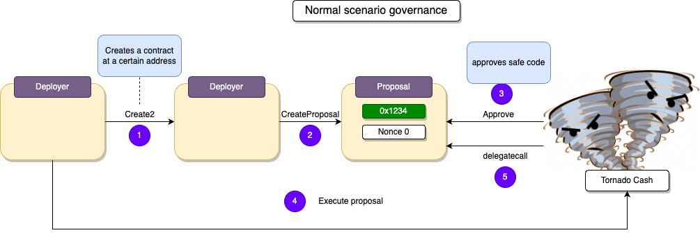

# TornadoCash

## Vulnerability

## Analysis

With governance, users can submit proposals that execute code within the Tornado protocol. A safety check is in place to examine the code for malicious content, preventing its execution if any is detected.

However, a significant issue arises when a user deploys malicious code on an address previously accepted through a proposal. In this scenario, the code can be executed, enabling the user to seize control over ownership or withdrawal of all funds in the pool.

To illustrate this vulnerability, we can distinguish between a standard situation and an exploited one.

## How can we deploy a proposal at the same address?

A address is generated using the formula `address = last 20 bytes of sha3(rlp(sender, nonce)).` 

By using the `create2` function, we can ensure the same sender, allowing us to deploy a proposal deployer.

The nonce represents the number of transactions the address has initiated, starting at nonce 0. Creating a second proposal increments the nonce to 1, resulting in a new address.

## How can we reset the nonce?

To reset the nonce, the contract address must be redeployed. The exploit is done by destroying the initial proposal and the proposal deployer and subsequently redeploying it at the same address using the `create2` function. This will reset the nonce

## Proof of Concept

1. The user initiates a proposal deploy contract on a specific address.
2. A proposal is created by the user, containing safe code.
3. Tornado conducts a safety check on the code and approves the proposal.
4. The proposal triggers self-destruction, followed by the deployer contract.
5. The deploy contract is redeployed at the same address, creating a proposal on the same address due to the reset nonce.
6. The user invokes the `execute proposal` function on Tornado, leading to the execution of malicious code

[**< Back**](https://patronasxdxd.github.io/CTFS/)
